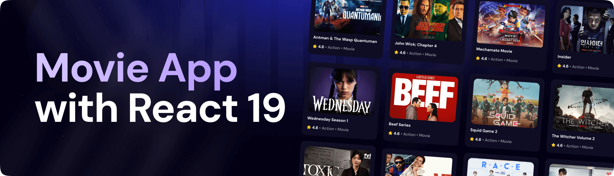

   
    
   
  
  

    
    
    
  

  <h3 align="center">A Movie Application</h3>

## <a name="features">🔋 Features</a>

👉 **Browse All Movies**: Explore a wide range of movies available on the platform.

👉 **Search Movies**: Easily search for specific movies using a search function.

👉 **Trending Movies Algorithm**: Displays trending movies based on a dynamic algorithm.

👉 **Modern UI/UX**: A sleek and user-friendly interface designed for a great experience.

👉 **Responsiveness**: Fully responsive design that works seamlessly across devices.

and many more, including code architecture and reusability

